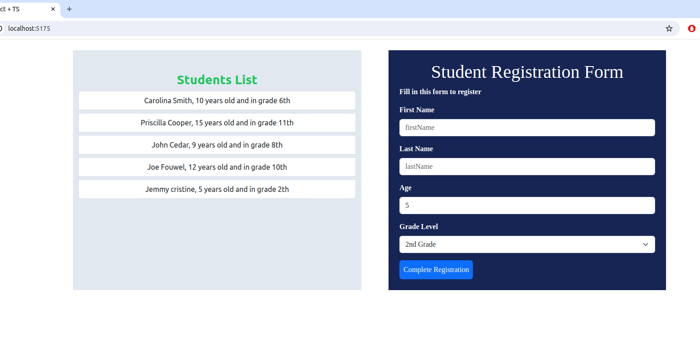

## 📝 Student Registration Form

A responsive and dynamic student registration form built using modern web development tools and practices. The form allows users to input student details such as name, age, and grade level, and displays the entered information dynamically upon submission.

---
## 🌟 Features

- **Dynamic Form:** Users can input their name, age, and grade level.
- **Instant Feedback:** Upon submission, the entered student information is displayed on the right side of the form.
- **Type Safety:** Utilizes TypeScript interfaces and props for robust type definitions.
- **State Management:** Efficient handling of component state changes.
- **Responsive Design:** Styled with Tailwind CSS and React Bootstrap for a clean and responsive UI.
- **Modern Tooling:** Built using Vite for fast development and optimized builds.
---
## Prerequisites
Make sure you have the following installed:

- Node.js (v14 or higher)
- npm (v6 or higher)
## 📦 Installation

1. **Clone the Repository**

   ```bash
   git clone git@github.com:TaranaGit/Student-Registration-Form-UI.git
   ```
2.  **Navigate to the project directory**
    ```bash
     cd Student-Registration-Form-UI
    ```
3. **Install dependencies**
    ```bash
    npm install
    ```
4. **Start the application**
    ```bash
    npm run dev 
    ```       
--- 

## 🛠️ Technologies Used

- **React**: A JavaScript library for building user interfaces.
- **TypeScript**: A typed superset of JavaScript that compiles to plain JavaScript.
- **Vite**: Next Generation Frontend Tooling.
- **Tailwind CSS**: A utility-first CSS framework.
- **React Bootstrap**: Bootstrap components built with React.
---

## 📚 Learning Points

- **TypeScript Interfaces & Props**: Implementing interfaces to define the shape of data and using props with type definitions to ensure component robustness.
- **Component State Management**: Handling form inputs and state changes effectively.
- **Styling with Tailwind & React Bootstrap**: Combining the utility-first approach of Tailwind CSS with the component-based styling of React Bootstrap to achieve a cohesive design.
- **Integrating Tailwind with Vite & React Bootstrap**: Setting up and configuring Tailwind CSS in a Vite-powered React project alongside React Bootstrap components.
---

## 🖥️ Screenshots



<!-- ## 🚀 Demo

[Live Demo Link](#) *(Replace this with your live demo link)* -->
